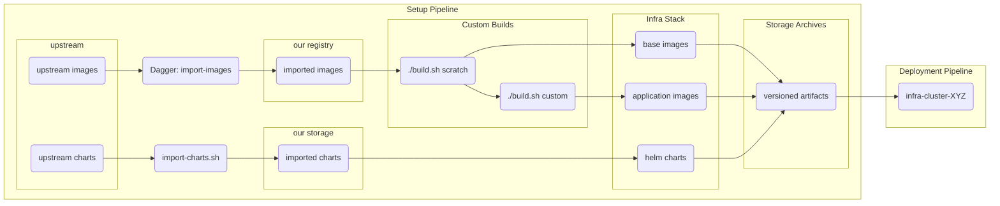

# infra-setup

Repository for versioning and generating pre-deployment artifacts for infra-cluster:
- Imports upstream container images (215+ images from Docker Hub, Quay, GCR, etc.)
- Builds custom docker images for infrastructure components
- Imports Helm charts from upstream repositories
- Archives artifacts to storage for airgap deployments

## Quick Start

### Local Development

See [BUILD-ORDER.md](BUILD-ORDER.md) for detailed build instructions.

```bash
# Build images locally
./build.sh scratch
./build.sh custom

# Build and push to registry
docker login cr.nrtn.dev
./build.sh scratch --push
./build.sh custom --push

# Build specific components only
./build.sh custom --components argocd,grafana
```

### Import Images with Dagger

See [.dagger/README.md](.dagger/README.md) for detailed Dagger documentation.

```bash
# List all images
dagger call list-images

# Import images to private registry
dagger call \
  with-docker-cfg --docker-cfg env://DOCKER_CFG \
  import-images
```

## Overview

This repository provides a unified build system for infrastructure components:

1. **Import upstream images** - 215+ container images copied to private registry (multiarch preserved)
2. **Build custom images** - Custom Dockerfiles for infrastructure components
3. **Import Helm charts** - Helm charts from upstream repositories
4. **Version everything together** - Single version tag for complete infrastructure stack
5. **Archive for airgap** - Optional archival to storage for offline deployments

## Build System

### Image Builds

Uses `./build.sh` with docker-compose files for automatic stage discovery:

- **scratch stage** (`docker-compose.scratch.yml`) - Base components
- **custom stage** (`docker-compose.custom.yml`) - Application images

See [BUILD-ORDER.md](BUILD-ORDER.md) for complete documentation.

### Image Imports

Uses Dagger module for importing 215+ upstream images with multiarch support.

See [.dagger/README.md](.dagger/README.md) for complete documentation.

### Helm Charts

Uses `./import-charts.sh` to import Helm charts from upstream repositories.

```bash
./import-charts.sh import-charts.yml docker/infra-charts/charts
```

Chart sources are defined in [import-charts.yml](import-charts.yml).

## CI/CD

### Forgejo Workflows

Located in `.forgejo/workflows/`:

#### images.yml (automatic - runs on push to master)

**Jobs:**
1. **import-images** - Imports base images from upstream registries using Dagger
2. **archive-images** - Archives images to storage (tags only)
3. **retag-generic-images** - Retags generic images for consistency
4. **build-custom-images** - Builds scratch and custom stages using `./build.sh`
5. **import-charts** - Imports Helm charts and uploads to storage (tags only)

**Triggers:**
- Automatic on push to master
- Automatic on pull requests (for testing)
- Manual via workflow_dispatch

**Features:**
- Uses Dagger for image imports
- Uses `./build.sh` for image builds
- Pushes to `infra-dev` namespace for commits, `infra` for tags
- Uses `cr.nrtn.dev` as default registry (override with `IMAGE_REGISTRY` variable)

#### mirror.yml (manual only)

**What it does:**
- Mirrors repository to GitHub (turbovillains/infra-setup)
- Pushes to GitLab (git.nrtn.dev/infra/infra-setup)

**Trigger:** Manual only via workflow_dispatch

### Required Secrets

For Forgejo Actions workflows:
- `DOCKER_CFG` - Base64 encoded Docker config.json (authentication)
- `SSH_PRIVATE_KEY` - SSH key for storage uploads and mirroring
- `DAGGER_CLOUD_TOKEN` - Dagger Cloud token (optional, for caching)

Optionally set:
- `IMAGE_REGISTRY` - Override default registry (default: cr.nrtn.dev)

```bash
# Create DOCKER_CFG secret:
cat ~/.docker/config.json | base64 -w0

# Create SSH_PRIVATE_KEY secret:
cat ~/.ssh/id_rsa | base64 -w0
```

## Configuration

### Build Variables

Build variables are loaded from `variables.yml`. This file contains version definitions for all upstream images and components.

Key environment variables (can be overridden):
- `IMAGE_REGISTRY` - Container registry (default: cr.nrtn.dev)
- `INFRA_NAMESPACE` - Image namespace (default: infra-dev)
- `INFRA_VERSION` - Version tag (default: git SHA or 'dev')

### Container Registry

The default registry is `cr.nrtn.dev`. This can be overridden via:
- `--registry` flag (for `./build.sh`)
- `IMAGE_REGISTRY` environment variable (for CI/CD)
- `--target-registry` flag (for Dagger)

## Architecture



## Documentation

- [BUILD-ORDER.md](BUILD-ORDER.md) - Detailed build system documentation
- [.dagger/README.md](.dagger/README.md) - Dagger module documentation
- [import-charts.yml](import-charts.yml) - Helm chart sources
- [variables.yml](variables.yml) - Version definitions

## Upgrades and Changes

Component versions are defined in [variables.yml](variables.yml).

When updating a component:
1. Update the version in `variables.yml`
2. Test the build locally
3. Push changes to trigger CI/CD pipeline
4. Tag the release when ready

The CI/CD pipeline will automatically:
- Import updated upstream images
- Build custom images with new versions
- Import updated Helm charts
- Archive everything for the new version (tags only)

## Local Prerequisites

- Docker with buildx support
- `yq` for YAML processing (required by `./build.sh`)

For Dagger operations:
- Dagger CLI installed

For chart imports:
- `yj` (YAML to JSON converter)
- `jq` (JSON processor)
- `helm` CLI

### Installing Prerequisites

```bash
# macOS
brew install yq jq helm
brew install sclevine/tap/yj
brew install dagger/tap/dagger

# Linux
# yq
wget https://github.com/mikefarah/yq/releases/latest/download/yq_linux_amd64 -O /usr/local/bin/yq
chmod +x /usr/local/bin/yq

# jq
sudo apt-get install jq

# yj
wget https://github.com/sclevine/yj/releases/latest/download/yj-linux-amd64 -O /usr/local/bin/yj
chmod +x /usr/local/bin/yj

# helm
curl https://raw.githubusercontent.com/helm/helm/main/scripts/get-helm-3 | bash

# dagger
curl -fsSL https://dl.dagger.io/dagger/install.sh | BIN_DIR=/usr/local/bin sh
```

## Legacy GitLab Pipeline

The GitLab CI configuration (`.gitlab-ci.yml`) is maintained for historical purposes but is no longer actively used. All CI/CD has been migrated to Forgejo workflows.
