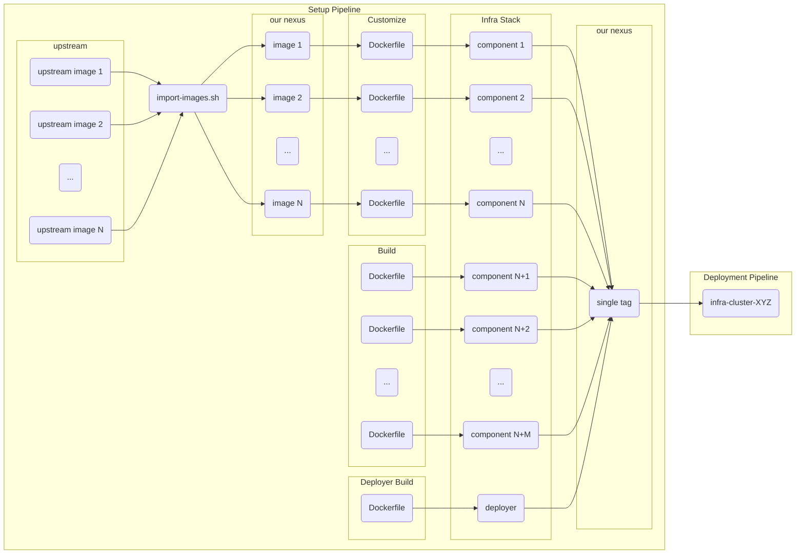

# infra-setup
===

Repository aim is to version and generate pre-deployment artifacts for infra-cluster:
- imports upstream components images
- docker images for compoenents
- builds deployment image

##  Overview

Idea is to:
* verision all infra compoenents as one set with the same tag
* import upstream images internally
* have a single versioned image for deployment
* allow to easily customise upstream docker images, or even build our own if necessary, without introducing major changes to other CI jobs

## What is imported
Currently following images are imported (see [gitlab/import-images.sh](gitlab/import-images.sh)):

## Where it goes

In [```.gitlab-ci.yml```](.gitlab-ci.yml), every job in build stage is a component name.

During build each image is uploaded to registry under common path ```${DOCKER_NAMESPACE}/${CI_JOB_NAME}``` with tag that is eaither commit hash (for branches) or tag (for tags)

## Deployer image

Deployer image is one that is later used to deploy complete infra stack.
It has inside Docker, full HashiCorp stack (terraform, nomad, vault, consul, envconsul and consul-template) and python virtualenv with Ansible installed.

## General setup pipeline overview

In a beautiful art:



## How to use

### Example building single docker image

```
docker build -t cr.nrtn.dev/sandbox/bitnami-keycloak:v0.0.350-dirty2 \
  --build-arg INFRA_VERSION=v0.0.350 \
  --build-arg INFRA_NAMESPACE=infra \
  --build-arg DOCKER_HUB=cr.nrtn.dev \
  --build-arg KEYCLOAK_THEMES_IMAGE=cr.nrtn.dev/infra/keycloak-themes:v0.0.350 \
  --build-arg BITNAMI_KEYCLOAK_VERSION=25.0.4 \
  --build-arg EMAIL_TOTP_AUTH_VERSION=2.0.0 \
  --push \
  .
```

```
  docker build -t cr.nrtn.dev/sandbox/keycloak:v0.0.350-dirty2 \
  --build-arg INFRA_VERSION=v0.0.350 \
  --build-arg INFRA_NAMESPACE=infra \
  --build-arg DOCKER_HUB=cr.nrtn.dev \
  --build-arg KEYCLOAK_THEMES_IMAGE=cr.nrtn.dev/infra/keycloak-themes:v0.0.350 \
  --build-arg KEYCLOAK_VERSION=25.0.4 \
  --build-arg EMAIL_TOTP_AUTH_VERSION=2.0.0 \
  --push \
  .
```

### Upgrades and changes

Component versions are in [```.gitlab-ci.yml```](.gitlab-ci.yml)

Changes may involve custom images, like compiling from source instead of upstream or other similar customizations

1. Whenever update of component happens, build this job, and tag it.
2. Refer to components with new tag

### Configuration

Variables that shall be setup for this repo are:

* ```DOCKER_HUB``` (mandatory) refers to target docker registry
* ```DOCKER_CFG``` (mandatory) is base64 encoded auth file for that registry
