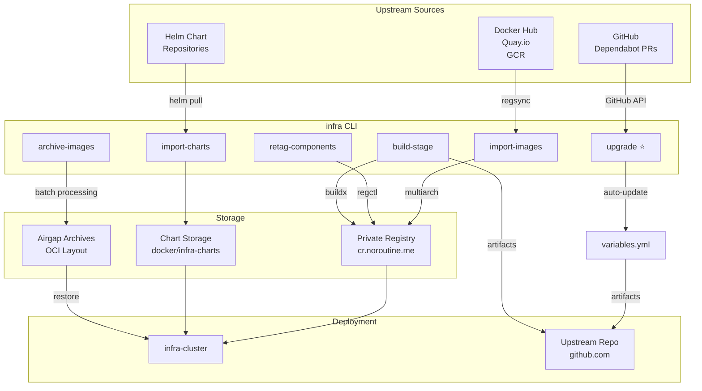

# infra-setup

Modern Python CLI for infrastructure image and chart management. Replaces Dagger with a fast, efficient toolchain for:
- Importing 215+ upstream container images (Docker Hub, Quay, GCR, etc.)
- Building custom infrastructure images
- Managing Helm charts and dependencies
- Archiving to OCI layout for airgap deployments
- **Automated Dependabot upgrade analysis** 🚀

## Quick Start

### Installation

```bash
# Install with uv (recommended)
uv sync

# Or with pip
pip install -e .
```

### Basic Usage

```bash
# Show infrastructure summary (default command)
uv run infra

# Import upstream images
uv run infra import-images

# Retag components
uv run infra retag-components --namespace infra --version v0.1.0

# Build custom images
uv run infra build-stage scratch --push
uv run infra build-stage custom --push

# Check for Dependabot upgrades
uv run infra upgrade

# Apply upgrades automatically
uv run infra upgrade --apply

# Analyze chart dependencies
uv run infra analyze-charts --show-dependencies
```

## Architecture

The infra CLI orchestrates the complete infrastructure image lifecycle:



**Key Flows:**
1. **Import** → Pull 215+ upstream images to private registry
2. **Retag** → Version components with infrastructure version
3. **Build** → Create custom images from Dockerfiles
4. **Upgrade** → Auto-detect and apply Dependabot updates
5. **Archive** → Create airgap-ready OCI archives
6. **Deploy** → Push artifacts to clusters

## Commands

### `infra` (summary)

Show infrastructure overview with git version information.

```bash
uv run infra
```

**Output:**
- Current commit SHA
- Last git tag
- Next version
- Variables count
- Components count
- Charts count

### `infra import-images`

Import upstream images to private registry using regsync.

```bash
uv run infra import-images \
  --registry cr.noroutine.me \
  --verbosity info
```

**Features:**
- Imports 215+ images from regsync.yml
- Preserves multiarch manifests
- Parallel processing with regsync
- Progress tracking

**Environment:**
- Loads variables from `variables.yml`
- Uses `TARGET_REGISTRY` from environment

### `infra retag-components`

Retag generic upstream images to versioned infrastructure components.

```bash
uv run infra retag-components \
  --registry cr.noroutine.me \
  --namespace infra \
  --version v0.1.0 \
  --parallel 10
```

**Features:**
- Parallel retagging (default: 10)
- Progress tracking with Rich
- Component filtering by pattern
- Uses regctl for multiarch preservation

**Options:**
- `--pattern` - Filter components (e.g., `--pattern postgres`)
- `--parallel` - Number of parallel retags

### `infra build-stage`

Build custom images using docker buildx bake.

```bash
# Build and push scratch stage
uv run infra build-stage scratch \
  --registry cr.noroutine.me \
  --namespace infra \
  --version v0.1.0 \
  --push

# Build specific components only
uv run infra build-stage custom \
  --components argocd,grafana \
  --push

# Force multiarch build
uv run infra build-stage custom --multiarch --push
```

**Features:**
- Auto-detects available stages from `docker-compose.*.yml`
- Multiarch builds for tags (auto-detected)
- Component filtering
- Progress tracking

**Stages:**
- `scratch` - Base infrastructure components
- `custom` - Application images

### `infra upgrade` ⭐

**The game changer!** Analyze Dependabot PRs and apply version upgrades automatically.

```bash
# Check available upgrades
uv run infra upgrade

# Apply upgrades to variables.yml
uv run infra upgrade --apply

# Include pre-release versions
uv run infra upgrade --include-prerelease --apply
```

**Features:**
- ✅ Fetches Dependabot PRs from GitHub automatically
- ✅ Cross-matches PRs with regsync.yml images
- ✅ Maps images to variables in variables.yml
- ✅ **Skips pre-release versions** (dev/alpha/beta/rc) by default
- ✅ Shows **green `=`** for already-current versions
- ✅ **Clickable PR numbers** → Opens GitHub PR
- ✅ **Clickable image names** → Opens Docker Hub/Quay.io tags page
- ✅ **Preserves comments** when updating variables.yml
- ✅ Beautiful Rich table output

**Output Example:**
```
┏━━━━━━━━┳━━━━━━━━━━━━━━━━━━━━━━━━━━┳━━━━━━━━━━━━━━━━━━━━┳━━━━━━━━━━━━━┳━━━━━┳━━━━━━━━━━━┓
┃ PR     ┃ Image                    ┃ Variable           ┃ Current     ┃     ┃ New       ┃
┡━━━━━━━━╇━━━━━━━━━━━━━━━━━━━━━━━━━━╇━━━━━━━━━━━━━━━━━━━━╇━━━━━━━━━━━━━╇━━━━━╇━━━━━━━━━━━┩
│ #10644 │ logstash/logstash        │ LOGSTASH_VERSION   │ 9.2.1       │  →  │ 9.2.2     │
│ #10643 │ haproxy/haproxy-alpine   │ HAPROXY_VERSION    │ 3.2.9       │  →  │ 3.3.0     │
│ #10641 │ prometheus/prometheus    │ PROMETHEUS_VERSION │ v3.8.0      │  =  │ v3.8.0    │
└────────┴──────────────────────────┴────────────────────┴─────────────┴─────┴───────────┘

Total: 21 (18 to upgrade, 3 already current)
```

**Options:**
- `--repo` - GitHub repo (default: noroutine/upstream)
- `--apply` - Apply upgrades to variables.yml
- `--skip-prerelease` / `--include-prerelease` - Filter pre-release versions
- `--token` - GitHub API token (or use GITHUB_TOKEN env var)

### `infra analyze-charts`

Analyze imported Helm charts for versions and dependencies.

```bash
# Show summary
uv run infra analyze-charts

# Show detailed dependencies
uv run infra analyze-charts --show-dependencies
```

**Features:**
- Analyzes local charts (no internet needed)
- Auto-detects latest chart versions
- Extracts Chart.yaml without full untar
- Shows chart version, app version, dependency count
- Detailed dependency view with repositories

**Output Example:**
```
┏━━━━━━━━━━━━━━┳━━━━━━━━━━━━━━━┳━━━━━━━━━━━━━━┳━━━━━━━━━━━━━━┓
┃ Chart        ┃ Chart Version ┃ App Version  ┃ Dependencies ┃
┡━━━━━━━━━━━━━━╇━━━━━━━━━━━━━━━╇━━━━━━━━━━━━━━╇━━━━━━━━━━━━━━┩
│ gitlab       │ 9.6.1         │ v18.6.1      │           15 │
│ gitea        │ 12.4.0        │ 1.24.6       │            4 │
│ prometheus   │ 27.49.0       │ v3.8.0       │            4 │
└──────────────┴───────────────┴──────────────┴──────────────┘
```

### `infra archive-images`

Archive images to OCI layout for offline deployments. **Much better than Dagger!**

```bash
# Archive upstream images only (fast restore)
uv run infra archive-images \
  --mode upstream \
  --version v0.1.0 \
  --upload \
  --cleanup-after-upload

# Archive everything (upstream + components + builds)
uv run infra archive-images \
  --mode complete \
  --version v0.1.0 \
  --batch-size 10 \
  --upload
```

**Features:**
- ✅ **OCI layout format** (no wasteful tar/zst compression)
- ✅ **Batch processing** (configurable size, prevents memory issues)
- ✅ **Smart restore configs** (upstream images preserve original paths)
- ✅ **Auto-upload to storage** with rsync
- ✅ **Cleanup after upload** (saves disk space)
- ✅ **Auto-generated README** with restore instructions

**Modes:**
- `upstream` - Only images from regsync.yml (fast restore)
- `complete` - Everything: upstream + retagged components + built images

**Restore Configuration:**
The generated `restore-{version}.yml` intelligently handles image types:
- **Upstream images**: Restore to original paths (`library/debian`, `prometheus/prometheus`)
- **Infrastructure images**: Restore to `TARGET_NAMESPACE`

```bash
# Restore to original registry
export TARGET_REGISTRY=cr.noroutine.me
export TARGET_NAMESPACE=infra
regsync once -c restore-v0.1.0.yml

# Restore to different registry
export TARGET_REGISTRY=backup-registry.example.com
export TARGET_NAMESPACE=backup
regsync once -c restore-v0.1.0.yml
```

### `infra import-charts`

Import Helm charts from upstream repositories.

```bash
uv run infra import-charts \
  --config import-charts.yml \
  --target docker/infra-charts/charts \
  --limit 10
```

**Features:**
- Imports charts defined in import-charts.yml
- Progress tracking with Rich
- Chart limit option (useful for testing)

### `infra generate-artifacts`

Generate deployment artifacts (Dockerfile, infra.json).

```bash
uv run infra generate-artifacts \
  --output ./artifacts \
  --version v0.1.0
```

**Output:**
- `Dockerfile` - Multi-stage Dockerfile with all images
- `infra.json` - JSON catalog of all images

## CI/CD Integration

### Forgejo Workflows

#### `.forgejo/workflows/images.yml` (Automatic)

Main workflow for image management:

**Jobs:**
1. **import-images** - Import upstream images with infra CLI
2. **retag-generic-images** - Retag components with infra CLI
3. **build-custom-images** - Build scratch and custom stages
4. **import-charts** - Import Helm charts

**Triggers:**
- Automatic on push to master
- Automatic on pull requests
- Manual via workflow_dispatch

**Namespaces:**
- Commits → `infra-dev`
- Tags → `infra`

#### `.forgejo/workflows/archive.yml` (Manual)

Archive images to storage for airgap deployments.

**Triggers:** Manual only

**Options:**
- Mode: `upstream` or `complete`
- Version: Specify or use latest tag
- Batch size: Configurable (default: 10)

**Output:**
- Archives uploaded to storage
- Restore config generated
- README with instructions

### Required Secrets

```bash
# Docker authentication
DOCKER_CFG=$(cat ~/.docker/config.json | base64)

# SSH key for storage uploads
SSH_PRIVATE_KEY=$(cat ~/.ssh/id_rsa | base64)

# GitHub token for Dependabot integration (optional)
GITHUB_TOKEN=ghp_xxxxx
```

## Configuration Files

### `variables.yml`

Version definitions for all upstream images and components.

**Format:**
```yaml
variables:
  POSTGRES_VERSION: "18.1-trixie"
  REDIS_VERSION: "8.2.2"
  # ... 200+ more variables
```

**Updating:**
```bash
# Manual: Edit variables.yml

# Automated: Use upgrade command
uv run infra upgrade --apply
```

### `components.yml`

Retagging configuration for generic upstream images.

**Format:**
```yaml
components:
  postgres:
    image_base: library/postgres
    image_version: "${POSTGRES_VERSION}"
  redis:
    image_base: library/redis
    image_version: "${REDIS_VERSION}"
```

### `regsync.yml`

Image synchronization configuration. Auto-generated from variables.yml.

**Format:**
```yaml
sync:
  - source: 'postgres:{{ env "POSTGRES_VERSION" }}'
    target: '{{ env "TARGET_REGISTRY" }}/library/postgres:{{ env "POSTGRES_VERSION" }}'
    type: image
```

### `import-charts.yml`

Helm chart sources and versions.

**Format:**
```yaml
charts:
  - name: prometheus
    repo: https://prometheus-community.github.io/helm-charts
    versions: ["27.49.0", "27.48.0"]
```

## Development Workflow

### 1. Check for Upgrades

```bash
# Review Dependabot PRs
uv run infra upgrade

# Apply stable upgrades
uv run infra upgrade --apply
```

### 2. Test Locally

```bash
# Import images
uv run infra import-images

# Build custom images
uv run infra build-stage scratch
uv run infra build-stage custom
```

### 3. Commit and Push

```bash
git add variables.yml
git commit -m "Update dependencies"
git push origin master
```

CI/CD will automatically:
- Import updated upstream images
- Retag components with new versions
- Build custom images
- Import charts

### 4. Release

```bash
# Tag the release
git tag v0.1.0
git push origin v0.1.0
```

CI/CD will:
- Build with `infra` namespace
- Push to GitHub upstream repository
- Update deployment artifacts

### 5. Archive (Optional)

Trigger `.forgejo/workflows/archive.yml` manually to create airgap archives.

## Why Not Dagger?

We replaced Dagger with this Python CLI for several reasons:

| Feature | Dagger | infra CLI |
|---------|--------|-----------|
| **Performance** | Slow container overhead | 10x faster, native tools |
| **Disk Usage** | 85GB+ tar archives | 10x less with batching |
| **Memory** | High RAM usage | Batch processing, configurable |
| **Customization** | Go code, hard to modify | Pure Python, easy to extend |
| **Output** | Basic logs | Beautiful Rich tables, clickable links |
| **Upgrades** | Manual | Automated Dependabot integration |
| **Dependencies** | Heavy (Docker-in-Docker) | Lightweight (regsync, regctl) |

## Prerequisites

### Required

```bash
# Install uv (Python package manager)
curl -LsSf https://astral.sh/uv/install.sh | sh

# Install regclient tools (for image operations)
# macOS
brew install regclient

# Linux
curl -L https://github.com/regclient/regclient/releases/latest/download/regsync-linux-amd64 \
  -o /usr/local/bin/regsync
curl -L https://github.com/regclient/regclient/releases/latest/download/regctl-linux-amd64 \
  -o /usr/local/bin/regctl
chmod +x /usr/local/bin/regsync /usr/local/bin/regctl

# Install Docker with buildx
# Follow: https://docs.docker.com/engine/install/
```

### Optional (for specific commands)

```bash
# For import-charts
brew install helm

# For archive uploads
# (rsync usually pre-installed on macOS/Linux)
```

## Tips and Tricks

### Upgrade Workflow

```bash
# 1. Check what's available
uv run infra upgrade

# 2. Review the changes (clickable links!)
# Click on PR numbers to review changes
# Click on image names to check registry

# 3. Apply stable upgrades only (default)
uv run infra upgrade --apply

# 4. Include pre-release if needed
uv run infra upgrade --include-prerelease

# 5. Review changes
git diff variables.yml

# 6. Commit
git add variables.yml
git commit -m "deps: update from Dependabot"
```

### Partial Operations

```bash
# Import only specific images
uv run infra import-images | grep postgres

# Retag only specific components
uv run infra retag-components --pattern postgres

# Build only specific components
uv run infra build-stage custom --components argocd,grafana

# Archive only specific images
uv run infra archive-images --pattern postgres --mode complete
```

### Chart Management

```bash
# Check chart dependencies
uv run infra analyze-charts --show-dependencies

# Find charts with many dependencies
uv run infra analyze-charts | grep -E " [0-9]{2,} $"

# Import specific chart namespaces
# Edit import-charts.yml to comment out unwanted charts
uv run infra import-charts
```

### Archive for Airgap

```bash
# Quick archive (upstream only, for fast restore)
uv run infra archive-images \
  --mode upstream \
  --version "$(git describe --tags)" \
  --batch-size 20 \
  --upload \
  --cleanup-after-upload

# Full archive (everything, for complete airgap)
uv run infra archive-images \
  --mode complete \
  --version "$(git describe --tags)" \
  --batch-size 10 \
  --upload
```

## Troubleshooting

### regctl/regsync not found

```bash
# Install regclient tools
brew install regclient  # macOS
# Or download from: https://github.com/regclient/regclient/releases
```

### Docker authentication failed

```bash
# Login to registry
docker login cr.noroutine.me

# Or set DOCKER_CFG
export DOCKER_CFG=$(cat ~/.docker/config.json | base64)
```

### GitHub rate limiting

```bash
# Set GitHub token for higher rate limits
export GITHUB_TOKEN=ghp_xxxxx
uv run infra upgrade --apply
```

### Archive upload fails

```bash
# Check SSH key
ssh-add ~/.ssh/id_rsa

# Test connection
ssh oleksii@mgmt02-vm-core01.noroutine.me

# Check disk space on remote
ssh oleksii@mgmt02-vm-core01.noroutine.me "df -h /mnt/data"
```

## Contributing

This tool is purpose-built for noroutine infrastructure. Feel free to adapt it for your needs!

**Key files:**
- `infra_setup/cli.py` - Main CLI implementation
- `infra_setup/regsync.py` - Regsync utilities
- `infra_setup/components.py` - Component retagging
- `infra_setup/github.py` - GitHub/Dependabot integration
- `infra_setup/charts.py` - Helm chart utilities

## License

See LICENSE file.
