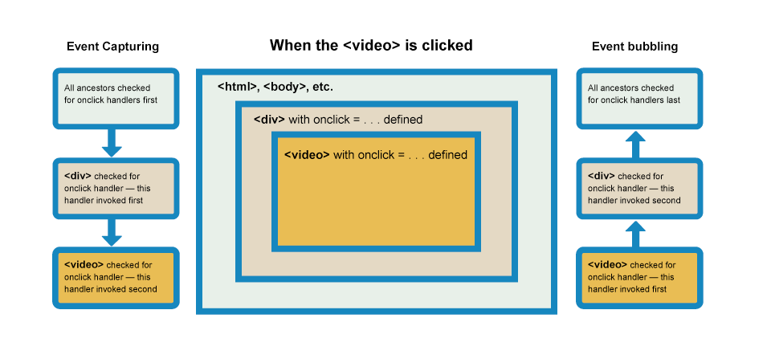
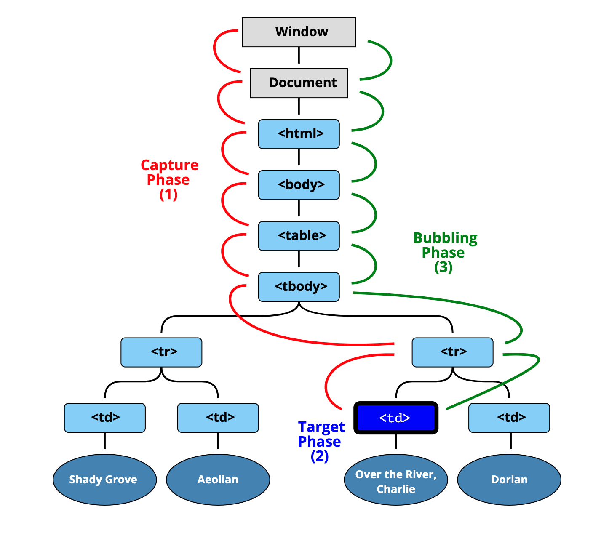
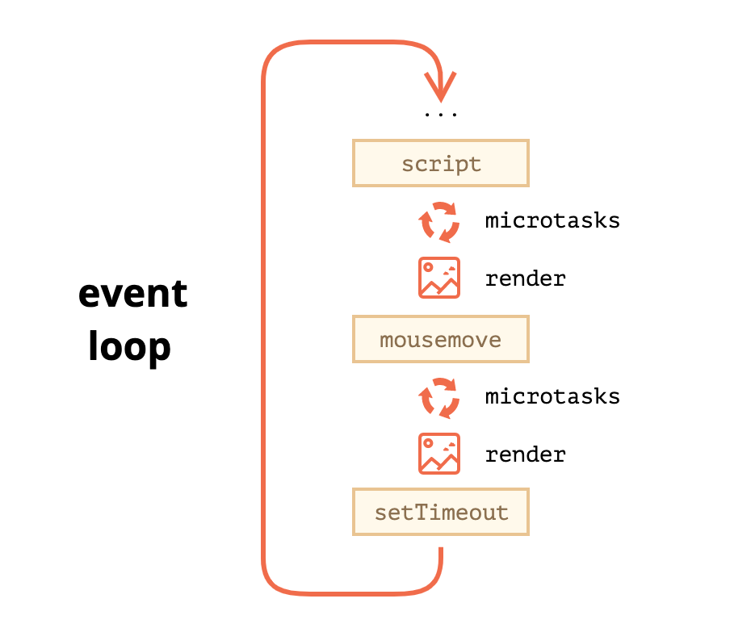

### [Web Workers](https://developer.mozilla.org/en-US/docs/Web/API/Web_Workers_API)

**Web Workers** makes it possible to run a script operation in a background thread separate from the main execution thread of a web application.

There are several types of web workers, that have global scope, different from global scope of main script

* `DedicatedWorkerGlobalScope` for **dedicated** workers (common type, utilized by a single script)
* `SharedWorkerGlobalScope` for **shared** workers (not widely supported, utilized by multiple scripts running in different windows, IFrames, etc., as long as they are in the same domain)
* `ServiceWorkerGlobalScope` for **service** workers (essentially act as proxy servers that sit between web applications, the browser, and the network)

A dedicated worker is only accessible from the script that first spawned it, whereas shared workers can be accessed from multiple scripts.

A shared worker is accessed by multiple scripts via a **port**.

Workers may themselves spawn new workers, as long as those workers are hosted at the same [origin](https://developer.mozilla.org/en-US/docs/Web/Security/Same-origin_policy) as the parent page

#### Example of Dedicated Worker

```javascript
// worker.js
onmessage = function(e) {
  console.log('Message received from main script');
  var workerResult = 'Result: ' + (e.data[0] * e.data[1]);
  console.log('Posting message back to main script');
  postMessage(workerResult);
}
```

```javascript
// create a dedicated worker
var myWorker = new Worker('worker.js');

// handle results via callback
myWorker.onmessage = function(e) {
  result.textContent = e.data;
  console.log('Message received from worker');
}

// send some work
myWorker.postMessage([first.value,second.value]);

// terminate
myWorker.terminate();
```

You can kill a dedicated worker by closing the page/frame that created it.

#### Example of Shared Worker

```javascript
// worker.js

// we have top-level onconnect instead of onmessage
onconnect = function(e) {
  var port = e.ports[0];

  // handle messages here
  port.addEventListener('message', function(e) {
    var workerResult = 'Result: ' + (e.data[0] * e.data[1]);
    port.postMessage(workerResult);
  });

  port.start(); // Required when using addEventListener. Otherwise called implicitly by onmessage setter.
}
```

```javascript
// create a shared worker
var myWorker = new SharedWorker('worker.js');

// attach result handler to port
myWorker.port.onmessage = function(e) {
  result1.textContent = e.data;
  console.log('Message received from worker');
}

// send some work via port, notice the difference with Dedicated Worker
myWorker.port.postMessage([first.value,second.value]);

myWorker.terminate()
```


You can kill a shared worker by closing all the pages of the domain that created it. Closing all domain pages invokes the shared worker's self-termination sequence.

### [Web Sockets](https://developer.mozilla.org/en-US/docs/Web/API/WebSockets_API)

The **WebSocket API** is an advanced technology that makes it possible to open a two-way interactive communication session between the user's browser and a server. With this API, you can send messages to a server and receive event-driven responses without having to poll the server for a reply.

Below is client-side example code. Protocols `protocolOne` and `protocolTwo` are arbitrary server-specific WebSocket sub-protocols.

```javascript
var exampleSocket = new WebSocket("wss://www.example.com/socketserver", "protocolOne");
// or 
var exampleSocket = new WebSocket("wss://www.example.com/socketserver", ["protocolOne", "protocolTwo"]);

// send some data
exampleSocket.onopen = function (event) {
  exampleSocket.send("Here's some text that the server is urgently awaiting!");
};

// get some data
exampleSocket.onmessage = function (event) {
  console.log(event.data);
}

// closing
exampleSocket.close();
```

Server-side is implemented via [various libraries](https://developer.mozilla.org/en-US/docs/Web/API/WebSockets_API#tools)

### [Async Iterators and Generators](https://javascript.info/async-iterators-generators)

Asynchronous iteration allow us to iterate over data that comes asynchronously, on-demand. Like, for instance, when we download something chunk-by-chunk over a network. Or paginating through results, where next pages need to be requested over the network.

Regular iterators and generators work fine with the data that doesn’t take time to generate.

When we expect the data to come asynchronously, with delays, their async counterparts can be used, and `for await..of` instead of `for..of`.

#### Async Iterators

Normal iterator

```javascript
let range = {
  from: 1,
  to: 5,

  [Symbol.iterator]() { // called once, in the beginning of for..of
    return {
      current: this.from,
      last: this.to,

      next() { // called every iteration, to get the next value
        if (this.current <= this.last) {
          return { done: false, value: this.current++ };
        } else {
          return { done: true };
        }
      }
    };
  }
};

for(let value of range) {
  alert(value); // 1 then 2, then 3, then 4, then 5
}
```

For async iterator the structure is similar, but differs in few key aspects:

1. Use `Symbol.asyncIterator` instead of `Symbol.iterator`.

2. The `next()` method should return a promise so it becomes `async next()`

3. To iterate over such an object, we should use a special await form of `for` loop

   ```
   for await (let item of iterable)
   ```

So async iterator version of above code will look this way:

```javascript
let range = {
  from: 1,
  to: 5,

  [Symbol.asyncIterator]() { // (1)
    return {
      current: this.from,
      last: this.to,

      async next() { // (2)

        // note: we can use "await" inside the async next:
        await new Promise(resolve => setTimeout(resolve, 1000)); // (3)

        if (this.current <= this.last) {
          return { done: false, value: this.current++ };
        } else {
          return { done: true };
        }
      }
    };
  }
};

(async () => {

  for await (let value of range) { // (4)
    alert(value); // 1,2,3,4,5
  }

})()

**The spread syntax** `...` **doesn’t work asynchronously**

#### Async Generators

Normal generator

```javascript
function* generateSequence(start, end) {
  for (let i = start; i <= end; i++) {
    yield i;
  }
}

for(let value of generateSequence(1, 5)) {
  console.log(value); // 1, then 2, then 3, then 4, then 5
}
```

It is a common practice for iterator to be generator, so our iterator-generator will look like below. All values come synchronously.

```javascript
let range = {
  from: 1,
  to: 5,

  *[Symbol.iterator]() { // a shorthand for [Symbol.iterator]: function*()
    for(let value = this.from; value <= this.to; value++) {
      yield value;
    }
  }
};

for(let value of range) {
  console.log(value); // 1, then 2, then 3, then 4, then 5
}
```

The async generator is similar, just uses `async` in front of `function*` and `for await` loop just like above with async iterators.

In case of async generator, the `generator.next()` method is asynchronous, it returns promises.

In a regular generator we’d use `result = generator.next()` to get values. In an async generator, we should add `await`. `for await` does exactly that under the hood.

```javascript
async function* generateSequence(start, end) {

  for (let i = start; i <= end; i++) {

    // Wow, can use await!
    await new Promise(resolve => setTimeout(resolve, 1000));

    yield i;
  }

}

(async () => {

  let generator = generateSequence(1, 5);
  for await (let value of generator) {
    console.log(value); // 1, then 2, then 3, then 4, then 5 (with delay between)
  }

})();
```

Above iterator-generator code would look like below in async version:

```javascript
let range = {
  from: 1,
  to: 5,

  // this line is same as [Symbol.asyncIterator]: async function*() {
  async *[Symbol.asyncIterator]() {
    for(let value = this.from; value <= this.to; value++) {

      // make a pause between values, wait for something
      await new Promise(resolve => setTimeout(resolve, 1000));

      yield value;
    }
  }
};

(async () => {

  for await (let value of range) {
    console.log(value); // 1, then 2, then 3, then 4, then 5
  }

})();
```

#### `Symbol.iterator` together with `Symbol.asyncIterator`

Technically, we can add both `Symbol.iterator` and `Symbol.asyncIterator` to the object, so it’s both synchronously (`for..of`) and asynchronously (`for await..of`) iterable.

In practice though, that would be a weird thing to do.

### [Mix-ins](https://developer.mozilla.org/en-US/docs/Web/JavaScript/Reference/Classes#mix-ins)

Adds functionality to class without extending it.

Essentially mix-in is a special kind of function nad has `"function"` type

```javascript
let calculatorMixin = Base => class extends Base {
  calc() { }
};

let randomizerMixin = Base => class extends Base {
  randomize() { }
};

class Foo { }
class Bar extends calculatorMixin(randomizerMixin(Foo)) { }
```


### [AbortController](https://developer.mozilla.org/en-US/docs/Web/API/AbortController)

The **`AbortController`** interface represents a controller object that allows you to abort one or more Web requests as and when desired by using **`AbortSignal`**

Example of aborting downloaded video

```javascript
var controller = new AbortController();
var signal = controller.signal;

var downloadBtn = document.querySelector('.download');
var abortBtn = document.querySelector('.abort');

downloadBtn.addEventListener('click', fetchVideo);

abortBtn.addEventListener('click', function() {
  controller.abort();
  console.log('Download aborted');
});

function fetchVideo() {
  ...
  fetch(url, {signal}).then(function(response) {
    ...
  }).catch(function(e) {
    reports.textContent = 'Download error: ' + e.message;
  })
}
```


### [Symbol.species](https://developer.mozilla.org/en-US/docs/Web/JavaScript/Reference/Global_Objects/Symbol/species)

Allows sublcass to pretend it is a base class

```javascript

class Array1 extends Array {
  static get [Symbol.species]() { return Array; }
}

const a = new Array1(1, 2, 3);
const mapped = a.map(x => x * x);

console.log(mapped instanceof Array1);
// expected output: false

console.log(mapped instanceof Array);
// expected output: true
```


#### [Computed Property Names](https://developer.mozilla.org/en-US/docs/Web/JavaScript/Reference/Operators/Object_initializer#computed_property_names)

ES6’s "Computed Property Names" feature allows you to have an expression (a piece of code that results in a single value like a variable or function invocation) be computed as a property name on an object.

```javascript
function objectify (key, value) {
  return {
    [key]: value
  }
}

objectify('name', 'Tyler') // { name: 'Tyler' }
```

#### [New notations in ES6](https://developer.mozilla.org/en-US/docs/Web/JavaScript/Reference/Operators/Object_initializer#new_notations_in_ecmascript_2015)

```javascript
// Shorthand property names (ES2015)
let a = 'foo', b = 42, c = {};
let o = {a, b, c}

// Shorthand method names (ES2015)
let o = {
  property(parameters) {}
}

// Computed property names (ES2015)
let prop = 'foo';
let o = {
  [prop]: 'hey',
  ['b' + 'ar']: 'there'
}
```


### [DOM Event Model](https://developer.mozilla.org/en-US/docs/Learn/JavaScript/Building_blocks/Events)

Here is [Event List](https://developer.mozilla.org/en-US/docs/Web/Events) for browsers. Node.js has [it's own event model](https://nodejs.org/docs/latest-v12.x/api/events.html). The event model in JavaScript for web pages differs from the event model for JavaScript as it is used in other environments.

Do not use inline event handlers

```html
<button onclick="handler()" ... // bad
```

#### Event Listeners aka DOM Level 2 Events 

```javascript
const controller = new AbortController();	// can remove handler
const btn = document.querySelector('button');
function bgChange() {};
btn.addEventListener('click', bgChange);
// with abort controller
btn.addEventListener('click', bgChange, {signal: controller.signal});
btn.removeEventListener('click', bgChange);
controller.abort(); // remove handler via abort controller signal
```

Advantages over previous era: multiple handlers, can change behaviour, can remove handlers using `AbortSignal`


#### Event object

`e.target` - subject of an event, where it originated

`e.currentTarget`- element that *handles* the event

`e.preventDefault() ` - prevent default event behaviour (like submitting form when clicking submit button)

`e.stopPropagation()` - prevents event to propagate further to ancestors or children

`e.stopImmediatePropagation()` - prevents event to propagate even to further handler on same target

#### Capturing and bubbling

Almost all events bubble.

The standard [DOM Events](http://www.w3.org/TR/DOM-Level-3-Events/) describes 3 phases of event propagation:

1. Capturing phase – the event goes down to the element.
2. Target phase – the event reached the target element.
3. Bubbling phase – the event bubbles up from the element.

Event handlers typically register for bubbling phase, use 3rd parameter to register handler to capture phase.






Sample demo

```html
<style>
  body * {
    margin: 10px;
    border: 1px solid blue;
  }
</style>

<form>FORM
  <div>DIV
    <p>P</p>
  </div>
</form>

<script>
  for(let elem of document.querySelectorAll('*')) {
    elem.addEventListener("click", e => alert(`Capturing: ${elem.tagName}`), true);
    elem.addEventListener("click", e => alert(`Bubbling: ${elem.tagName}`));
  }
</script>
```

#### Event Delegation

Bubbling also allows us to take advantage of **event delegation** - simply delegate event handler to parent element.

### [Optional Chaining](https://developer.mozilla.org/en-US/docs/Web/JavaScript/Reference/Operators/Optional_chaining)

The `?.` operator is like the . chaining operator, except that instead of causing an error if a reference is *nullish* (`null` or `undefined`), the expression short-circuits with a return value of `undefined`

```javascript
obj.val?.prop
obj.val?.[expr]
obj.arr?.[index]
obj.func?.(args)
```

### [Classes](https://developer.mozilla.org/en-US/docs/Web/JavaScript/Reference/Classes)

```javascript
class Rectangle {
  constructor(height, width) {
    this.height = height;
    this.width = width;
  }
}
```

Before

```javascript
Rectangle() {
    this.height = height;
    this.width = width;
}
```

A constructor can use the `super` keyword to call the constructor of the super class

```javascript
class Polygon {
  // Private fields
  #height = 0;
  #width;
  constructor(...sides) {
    this.sides = sides;
  }
  // Getter
  get area() {
    return this.calcArea();
  }
  // Method
  calcArea() {
    return this.height * this.width;
  }
  // Generator method
  *getSides() {
    for(const side of this.sides){
      yield side;
    }
  }
  // Iterator method
  *[Symbol.iterator] () {
    yield 1;
    yield 2;
    yield 3;
  }

	// static property
  static displayName = "Polygon";
}
```

Static methods and properties are only available for class itself and are not available via instance


### [Microtasks](https://developer.mozilla.org/en-US/docs/Web/API/HTML_DOM_API/Microtask_guide)



Promise handlers are run as microtasks

https://javascript.info/event-loop

So, usual tasks, like handlers, small computations => tasks, `setTimeout()`, `setInterval()`, executres later after other tasks

small tasks, like promises, super-tiny code => microtasks, `queueMicrotask()`, executes asynchronously but within the same loop cycle

long, heavy tasks => use web workers

### [`Promise`](https://developer.mozilla.org/en-US/docs/Web/JavaScript/Reference/Global_Objects/Promise#constructor)

`.then` handler for successfully fullfilled promises

`.catch` handler for rejected promises

`.finally` handler for resolved promises, whether fullfilled or rejected


### [`async/await`](https://javascript.info/async-await)

Allows to work with Promises without verbosity of `.then`, `.catch`

The `async` keyword before a function has two effects:

1. Makes it always return a promise.
2. Allows `await` to be used in it.

The `await` keyword before a promise makes JavaScript wait until that promise settles, and then:

1. If it’s an error, the exception is generated — same as if `throw error` were called at that very place.
2. Otherwise, it returns the result.


Async functions **always** return a `Promise`

```javascript
async function f() {
  return 1; // implicitly wrapped into Promise
}
```

`await` is only allowed inside `async` function and waits for other promise to resolve. Top-level `await` works in modules

`await` accepts Promise-compatible or **thenebles** (objects that have `.then(resolve, reject)` method).

#### Errors in Promises

If a promise resolves normally, then `await promise` returns the result. But in the case of a rejection, it throws the error, just as if there were a `throw` statement at that line.

Handled as any other `throw` with `try...catch...`

```javascript
async function f() {

  try {
    let response = await fetch('http://no-such-url');
    let user = await response.json(); // 2nd promise
  } catch(err) {
    alert(err); // TypeError: failed to fetch
  }
}

f();
```


### [Modules](https://developer.mozilla.org/en-US/docs/Web/JavaScript/Guide/Modules)

It is called importing and exporting module *features*.

Anything can be exported/imported - variables, constants, functions, classes.

New extension `.mjs` is recommended, but should have correct MIME-type set on servers.

In browser

````html
<script type="module" src=...
````

or

```html
<script type="module">
  /* JavaScript module code here */
</script>
```

Each module is executed only once

#### Named exports

```javascript
export { name, draw, reportArea, reportPerimeter };
```

```javascript
import { name, draw, reportArea, reportPerimeter } from './modules/square.js';
```

#### Default exports

```javascript
export default randomSquare;
```

anonymous function exported

```javascript
export default function(ctx) {
  /* ... */
}
```

```javascript
// no curly braces!
import randomSquare from './modules/square.js';
// same, but more verbose
import {default as randomSquare} from './modules/square.js';
```

#### Renaming

```javascript
import { function1 as newFunctionName,
         function2 as anotherNewFunctionName } from './modules/module.js';
```

#### Module object

```javascript
import * as Module from './modules/module.js';

Module.function1();
Module.function2();
```

#### Aggregated modules

```javascript
// shapes.js
export { Square } from './shapes/square.js';
export { Triangle } from './shapes/triangle.js';
export { Circle } from './shapes/circle.js';
```

and then

```javascript
// importing from modules separately
import { Square } from './modules/square.js';
import { Circle } from './modules/circle.js';
import { Triangle } from './modules/triangle.js';

// can be reduced to just
import { Square, Circle, Triangle } from './modules/shapes.js';
// or even 
import * as Shape from './modules/shapes.js'
```


#### Dynamic module loading aka dynamic import

`import()` function returns a `Promise`

```javascript
import('./modules/myModule.js')
  .then((module) => {
    // Do something with the module.
  });
```


#### Top-level `await` is possible in modules!

```javascript
// fetch request
const colors = fetch('../data/colors.json')
	.then(response => response.json());

export default await colors;
```


### [`for ... of ...`](https://developer.mozilla.org/en-US/docs/Web/JavaScript/Reference/Statements/for...of)

Two protocols work in concert:

* [Iterable protocol](https://developer.mozilla.org/en-US/docs/Web/JavaScript/Reference/Iteration_protocols#the_iterable_protocol)

* [Iterator protocol](https://developer.mozilla.org/en-US/docs/Web/JavaScript/Reference/Iteration_protocols#the_iterator_protocol)

In order to be **iterable**, an object must implement the **`@@iterator`** method, that returns **`iterator`** 

The ECMAScript 2015 (ES6) specification uses `@@iterator` to reference `Symbol.iterator`.

There is no `@@iterator` function. That token produces a syntax error - it is [only used in specification](https://stackoverflow.com/q/29492333/1048572) to denote a specific symbol.

If you want to use that symbol in your code, e.g. to access iterators on arrays, you have to use `Symbol.iterator`. Which is a property of the `Symbol` class initialised to have the value `@@iterator`.

#### Built-in iterables

`String`, `Array`, `TypedArray`, `Map`, and `Set` are all built-in iterables, because each of their prototype objects implements an `@@iterator` method.

#### User-defined iterable example

```javascript
const myIterable = {};
myIterable[Symbol.iterator] = function* () {
    yield 1;
    yield 2;
    yield 3;
};
console.log([...myIterable]); // [1, 2, 3]
```

### Generators

A [generator object](https://developer.mozilla.org/en-US/docs/Web/JavaScript/Reference/Global_Objects/Generator) is *both* iterator and iterable:

`function*`creates a generator

```javascript
function* makeSimpleGenerator(array) {
  let nextIndex = 0;
  while (nextIndex < array.length) {
    yield array[nextIndex++];
  }
}

const gen = makeSimpleGenerator(['yo', 'ya']);

console.log(gen.next().value); // 'yo'
console.log(gen.next().value); // 'ya'
console.log(gen.next().done);  // true
```

`yield*` delegates to another generator

```javascript
function* gen() {
  yield* ['a', 'b', 'c'];
}
```


### Good Links

[Re-Introduction to JavaScript](https://developer.mozilla.org/en-US/docs/Web/JavaScript/A_re-introduction_to_JavaScript)

[ES6 Syntax and Feature Overview](https://www.taniarascia.com/es6-syntax-and-feature-overview/)

[Nice cartoons about modules](https://hacks.mozilla.org/2018/03/es-modules-a-cartoon-deep-dive/)

[Global Objects](https://developer.mozilla.org/en-US/docs/Web/JavaScript/Reference/Global_Objects)

[React Tutorial: An Overview and Walkthrough](https://www.taniarascia.com/getting-started-with-react/)

[How to Code in JavaScript Series](https://www.digitalocean.com/community/tutorial_series/how-to-code-in-javascript)

